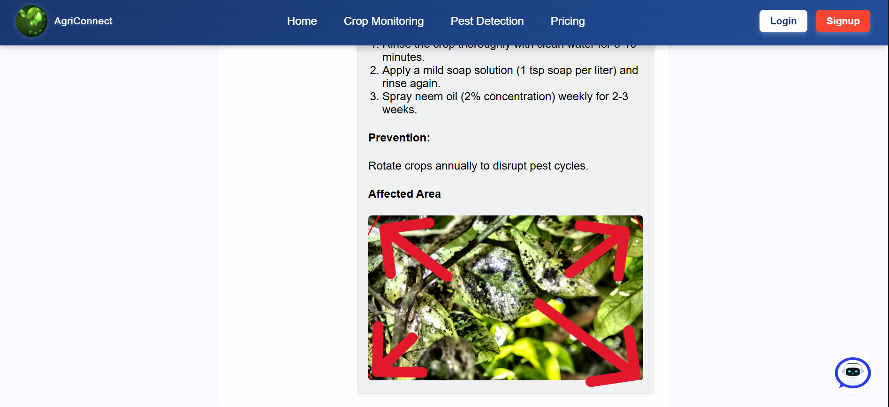
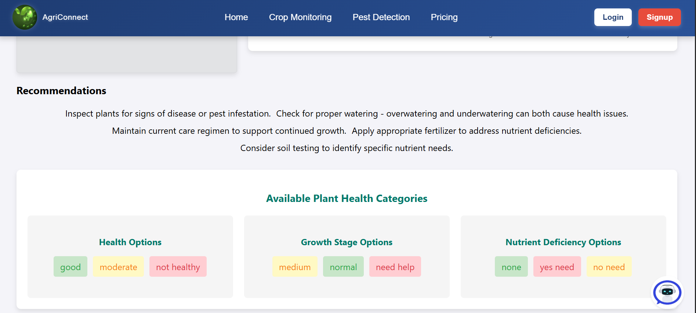

# AI Farmer Solution

## 🌱 Overview
The **AI Farmer Solution** is an AI-driven platform designed to assist small and marginal farmers in overcoming agricultural challenges such as climate change, resource constraints, and inefficient farming practices. This solution integrates **machine learning, computer vision, and real-time weather insights** to provide farmers with actionable recommendations, market transparency, and automated crop monitoring.

Additionally, the platform enables **global crop trend analysis and monitoring** using **IP-based location tracking**, allowing farmers to stay updated on worldwide agricultural developments. Farmers can also **connect with agricultural specialists, other farmers globally and across India**, and collaborate seamlessly. The marketplace ensures **government transparency** by allowing farmers to sell their crops at **official Minimum Support Prices (MSP)** set by the government, preventing exploitation and ensuring fair trade.

## 🚀 Features
- **Global Crop Trends & Monitoring** 🌾
  - Tracks **global crop production trends** using **IP-based geolocation**.
  - Helps farmers make informed decisions based on **regional agricultural patterns**.

- **Pesticide Detection using Computer Vision** 📷
  - Uses **YOLO and OpenCV** to detect pesticides on crops.
  - Achieves **72.89% accuracy** in identifying affected crops.
  - Provides **prevention and treatment advice** using **Google Gemini API** and **Vertex AI**.

- **Farmer & Buyer Marketplace with Government Transparency** 🌼
  - Connects **farmers and crop buyers** while ensuring compliance with **Minimum Support Prices (MSP)** set by the government.
  - Ensures **full transparency and prevents exploitation**.
  - Facilitates **conflict-free transactions** for small and marginal farmers.

- **Collaboration & Knowledge Sharing** 📝
  - Small farmers can **connect with agricultural specialists** and other farmers globally.
  - **Chat and interact** with experts, buyers, and fellow farmers to share experiences and best practices.
  - Keeps farmers updated about **new technologies in agriculture**.

- **Weather Analysis & Predictions** ☁️
  - Integrates **Weather API** to offer real-time climate updates.
  - Recommends **best farming practices** based on environmental conditions.

- **AI Chatbot for Agricultural Assistance** 🤖
  - Provides **instant AI-powered farming guidance**.
  - Answers questions related to **crop selection, soil health, pest control, and irrigation**.
  - Uses **Google Gemini API** for intelligent responses.

- **Offline Data Access** 📶
  - Provides **offline data access** to ensure farmers can get vital information without network issues.
  - Allows farmers to download **essential data** and access it **offline**.

## 🛠️ Tech Stack
### **Frontend:**
- **React.js** (with CSS for UI/UX)
- **RESTful API integration**

### **Backend:**
- **Node.js & Express.js** (Server-side logic at `http://localhost:5000`)
- **Google Gemini API** (AI-powered chatbot)
- **Mongoose & MongoDB** (Database for storing farmer-buyer transactions and queries)

### **Machine Learning & AI:**
- **YOLO & OpenCV** (For pesticide detection and Crop Health monitoring)
- **FFMPEG AND NGROK** (Crop monitroing and RTSP url for drone capturing crops)
- **PaddleOCR** (For text extraction from images)
- **TensorFlow & PyTorch** (For AI-based insights)
- **Vertex AI** (For enhanced AI capabilities)

## 🏢 Government Transparency in Transactions
- Ensures **buyer and farmer transactions** follow the **Minimum Support Prices (MSP)** set by the government.
- Eliminates **middlemen** and prevents **price manipulation**.
- Offers **direct selling channels** for farmers under **government supervision**.
- Maintains **digital records** to ensure **fair pricing and compliance**.
  
## 🚀 New Startup Considerations

### 1. **Problem Identification**
   - Understand the core problems faced by small and marginal farmers.
   - Analyze the impact of climate change, resource constraints, and inefficient farming practices on farmers.

### 2. **Market Research**
   - Conduct thorough market research to understand the current agricultural landscape.
   - Identify potential competitors and analyze their strengths and weaknesses.
   - Assess the demand for AI-driven agricultural solutions.

### 3. **Technology Stack**
   - Choose the right technology stack for frontend and backend development.
   - Integrate machine learning and computer vision for crop monitoring and pesticide detection.
   - Utilize real-time weather APIs for climate analysis and predictions.

### 4. **Product Development**
   - Develop a user-friendly platform with features like global crop trend monitoring, pesticide detection, and a farmer-buyer marketplace.
   - Ensure the platform supports collaboration and knowledge sharing among farmers and agricultural specialists.
   - Implement an AI-powered chatbot for instant farming guidance.

### 5. **Government Compliance**
   - Ensure the platform complies with government regulations and policies.
   - Integrate features that promote government transparency in transactions, such as selling crops at official Minimum Support Prices (MSP).

### 6. **Funding and Investment**
   - Seek funding from investors interested in agritech and AI solutions.
   - Explore government grants and subsidies for agricultural startups.

### 7. **Partnerships and Collaborations**
   - Partner with agricultural experts, research institutions, and technology providers.
   - Collaborate with local and global farming communities to gather insights and improve the platform.

### 8. **Marketing and Outreach**
   - Develop a comprehensive marketing strategy to reach small and marginal farmers.
   - Utilize social media, local community events, and agricultural fairs to promote the platform.
   - Highlight success stories and case studies to build trust and credibility.

### 9. **User Training and Support**
   - Provide training sessions and workshops to help farmers understand and use the platform effectively.
   - Offer continuous support through customer service and an AI-powered chatbot.

### 10. **Continuous Improvement**
   - Gather feedback from users to identify areas for improvement.
   - Continuously update the platform with new features and enhancements based on user feedback and technological advancements.
     
## 🌟 Setup Guide
### **Prerequisites**
- Install **Node.js** and **npm**
- Install **MongoDB** (or use MongoDB Atlas for cloud database)
- Install **Anaconda** for Python dependencies
- Install **OpenCV, YOLO, and PaddleOCR**

### **Installation Steps**
1. **Clone the repository**
   ```sh
   git clone https://github.com/GautamKumar2005/AI_Driven_Solutions_for_farmers_in_India.git
   cd ai-farmer-solution
   ```

2. **Backend Setup**
   ```sh
   cd backend
   npm install
   npm start
   ```

3. **Frontend Setup**
   ```sh
   cd frontend
   npm install
   npm start
   ```

4. **Install Python Dependencies**
   ```sh
   conda create --name ai_farmer python=3.8 or python=3.12.8
   conda activate ai_farmer
   pip install opencv-python paddleocr tensorflow torch torchvision
   ```
   or
   ```sh
   pip install -r requirements.txt
   python --version
   where python
   ```

6. **Update Backend Python Path**
   - Open `backend/routes/crop_monitoring.js` and `backend/routes/pestDetection.js`
   - Replace:
     ```js
     const pythonExePath = 'C:\\Users\\gauta\\anaconda3\\python.exe';
     ```
     with **your system's Python executable path**.

## 💡 Usage
- **Visit** `http://localhost:3000` to access the AI Farmer web application.
- **Enter farming-related queries** in the chatbot to receive AI-driven responses.
- **Upload crop images** for pesticide detection.
- **Monitor weather conditions** and make data-driven farming decisions.
- **Sell crops at MSP rates** directly to buyers with **government-approved pricing**.

## 📌 Future Enhancements
- **Automated Disease Detection** with higher accuracy.
- **Multilingual Support** to assist farmers in regional languages.
- **Blockchain-based Secure Transactions** for farmer-to-buyer dealings.
- **IoT Integration** for **real-time soil and crop monitoring**.

## 🤝 Contributing
Contributions are welcome! Feel free to **fork** this repository, create feature branches, and submit **pull requests**.

## 📞 Contact
For any queries, feel free to reach out:
- **GitHub:** [GitHub](https://github.com/GautamKumar2005/AI_Driven_Solutions_for_farmers_in_India/)

---

## File Structure
```plaintext
ai-farmer-solution/
│
├── backend/
│   ├── build/
│   ├── yolo/
│   ├── models/
│   ├── routes/
│   ├── index.js
│   ├── package.json
│
├── frontend/
│   ├── public/
│   ├── src/
│   ├── package.json
│
├── ai/
│   ├── yolo/ 
│   ├── crop_monitoring.py
│   ├── monitor.py  
│   ├── offline_data_retrieval.py 
│   ├── pest_detection.py
│
├── README.md
```

🚜 Empowering Farmers with AI! 🌿






## Additional Setup Instructions

### ngrok Setup
1. Download ngrok from [ngrok.com](https://ngrok.com/download).
2. Unzip the downloaded file and place it in a directory of your choice.
3. Add the directory to your system's PATH environment variable.
4. To expose a local server to the internet, use the following command:
   ```sh
   ngrok http 5000
   ```
5. This will generate a public URL that tunnels to your local server running on port 5000.

### ffmpeg Setup
1. Download ffmpeg from [ffmpeg.org](https://ffmpeg.org/download.html).
2. Unzip the downloaded file and place it in a directory of your choice.
3. Add the directory to your system's PATH environment variable.
4. Verify the installation by running the following command:
   ```sh
   ffmpeg -version
   ```

### RTSP URL for Drone Tracking
   Example:
   ```sh
   rtsp://your-drone-ip-address:port/stream
   ``` 
   
